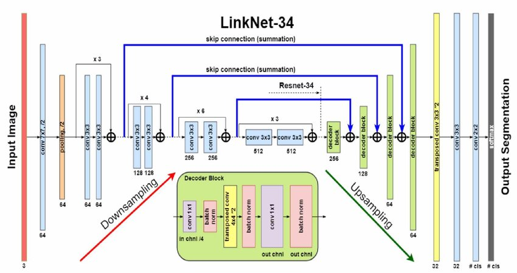

Наша задача заключалась в разработке модели для сегментации затопленных территорий с использованием мультиспектральных данных дистанционного зондирования Земли. Это позволит автоматизировать процесс распознавания водных поверхностей и оценить ущерб, нанесенный объектам инфраструктуры в результате паводков. Данная задача была дана на хакатоне - **[Цифровой прорыв / Нижний Новгород](https://hacks-ai.ru/events/1077381)**.

<body>
  

    <h2>Содержание / Навигация:</h2>
    <ul>
      <li><a href='#11'>Описание</a></li>
      <ol>
        <li><a href='#12'>Библиотеки</a></li>
        <li><a href='#13'>Навигация по директории</a></li>
        <li><a href='#14'>Запуск моделей</a></li>
      </ol>
      <li><a href='#21'>Решение задачи</a></li>
      <ol>
        <li><a href='#22'>Описание</a></li>
        <li><a href='#23'>Архитектура</a></li>
        <li><a href='#24'>Решение</a></li>
        <li><a href='#25'>Преимущества</a></li>
      </ol>
      <li><a href='#31'>Состав команды и результат</a></li>
      <ol>
        <li><a href='#32'>Состав команды</li>
        <li><a href='#33'>Результат</li>
      </ol>
  

    <h2 id='11'>Описание:</h2>
    <h3 id='12'>👉 Библиотеки</h3>
    
Все <b>необходимые</b> библиотеки можно установить, написав в терминал: <code>pip install -r requirements.txt</code>

    <h3 id='13'>👉 Навигация по директории:</h3>
    <pre>
      - requirements.txt // текстовый файл с названиями библиотек и их версиями
      - <b>data // папка с моделями и ноутбуками</b>
      - >> <b>models // папка с моделями</b>
      - >> experiments.ipynb // эксперименты
      - >> predict.ipynb // рабочая модель
      - >> Learning_model.ipynb // обучение модели
    </pre>
    <h3 id='14'>👉 Запуск моделей:</h3>
    
Для запуска <b>проекта</b>: нужно полностью запустить <b>predict.ipynb</b> кроме того, нужно в папку <b>data</b> переместить датасеты и поменять путь для изображений в блокноте.

    
Для запуска <b>одной из модели</b>:

    
В ноутбуке <b>predict.ipynb</b> в переменной <b>WaterSeg</b> указать нужную модель. В нашем репозитории представлено 5 модели: <b>DeepLabV3.pt</b>, <b>FPN.pt</b>, <b>LinkNet.pt</b> <i>[основная модель]</i>, <b>Unet.pt</b>, <b>UnetPlusPlus.pt.</b>

  

  

    <h2 id='21'>🤜 Решение задачи:</h2>
    <h3 id='22'>👉 Описание:</h3>
        
Для решения задачи определения затопленных территорий по данным дистанционного зондирования Земли (ДЗЗ) был использован метод семантической сегментации по архитектуре <b>LinkNet</b>.

    <h3 id='23'>👉 Архитектура модели:</h3>
    
Архитектура <b>LinkNet:</b>

     
    <h3 id='24'>👉 Решение:</h3>
    
На первом шаге мы разбиваем изображения на окна размером 256х256 пикселей.

    
На втором шаге мы получаем маски предсказаний.

    
На третьем шаге мы объединяем эти маски до размера исходного изображения.

    
На четвертом мы производим постобработку, с использованием морфологической фильтрации для удаления шума. Шум в данной задачи - это дом по середине, но вокруг вода, поэтому скорее всего данный дом затоплен.

    
На пятом шаге получаем итоговое предсказание.

    <h3 id='25'>👉 Преимущества:</h3>
    <ul>
      <li>Возможность работать с маломощными вычислительными ресурсами.</li>
      <li>Постобработка / удаление шумов.</li>
      <li>С моделью <b>LinkNet</b> метрика составляет <b>0.92</b>.</li>
    </ul>
  

    

    

    <h2 id='31'>Состав команды и результат:</h2>
    <h3 id='32'>👉 Состав команды:</h3>
    <ol>
        <li><a href='https://github.com/shavelo'>Павел Шабуров - ML</a></li>
        <li><a href='https://github.com/bigilittle'>Денис Басанский - ML</a></li>
        <li><a href='https://github.com/spioncino'>Максим Меркулов - ML</a></li>
        <li><a href='https://github.com/zoLikeCode'>Никита Зонтов - ML/Backend</a></li>
    </ol>
    <h3 id='33'>👉 Результат:</h3>
    Заняли 5 место. По F1 - 0.92, по IOU - 0.88
    

</body>
